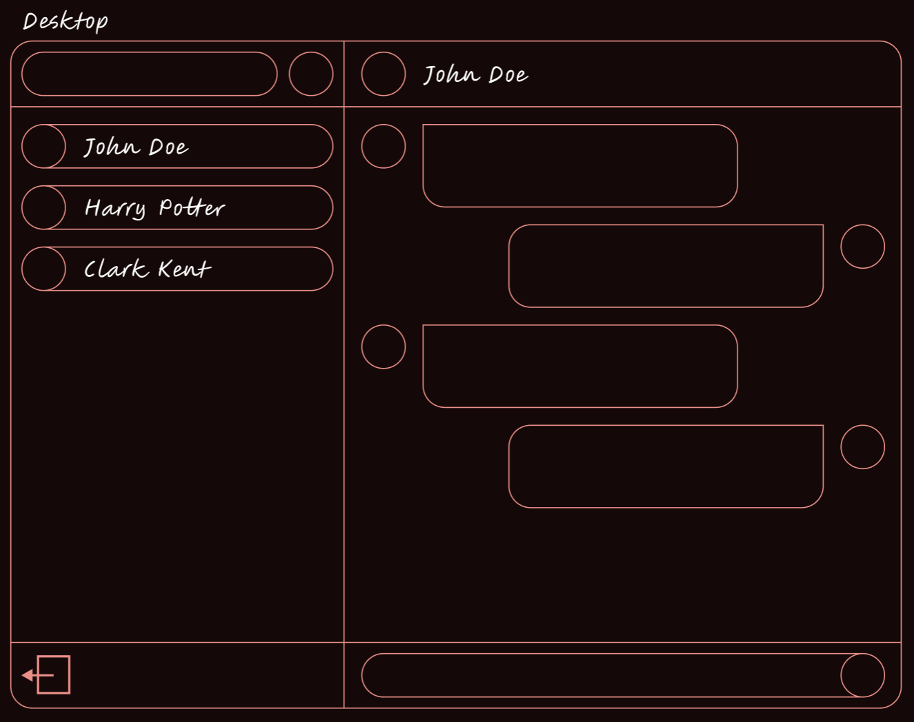

Instant Messaging App build using React.js and Node.js.

## Techstack
Frontend:
- React.js
- Tailwind

Backend:
- Node.js
- Express.js
- JWT
- Societ.io

Database:
- MongoDB

## Message model

## Frontend designs
### Desktop

### Mobile

